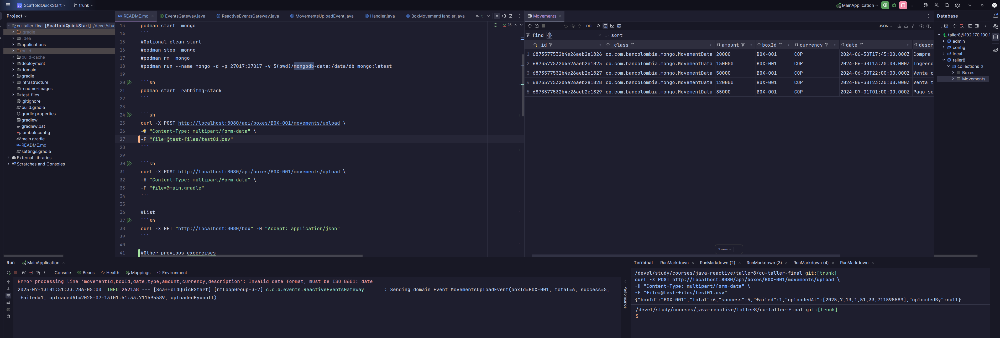
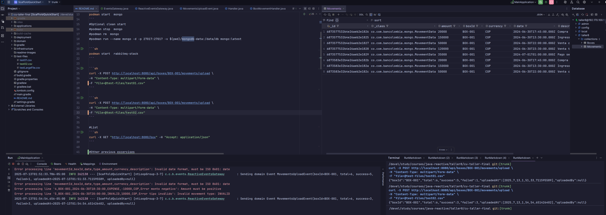
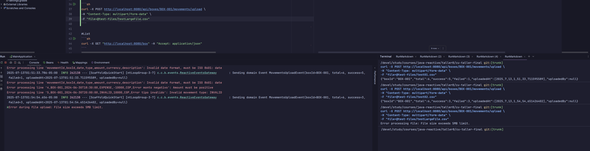
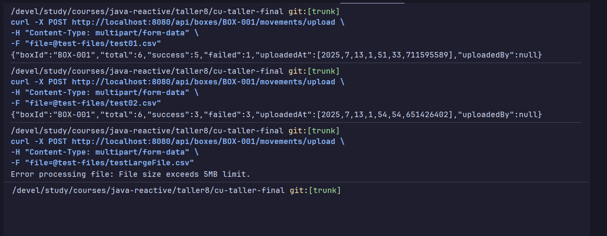
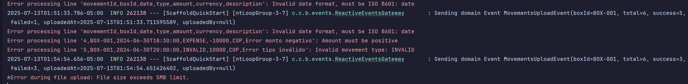
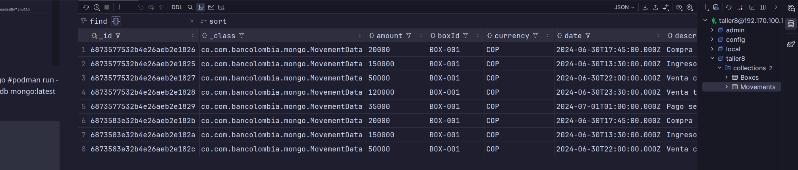

## Clean Archicture Study project 
#### for this study project i used the following resources:

### Podman and MongoDB and RabbitMQ

### Run MongoDB with Podman

```sh
podman  machine start
```

```sh
podman start  mongo
```

```sh
podman start  rabbitmq-stack
```
## Box creation 
```sh
curl -X POST "http://localhost:8080/box" \
  -H "Content-Type: application/json" \
  -d '{
    "id": "BOX-001",
    "name": "Sample Box",
    "status": "OPENED",
    "openingAmount": 1000.00,
    "closingAmount": 1500.00,
    "openedAt": "2024-06-01T10:00:00",
    "closedAt": "",
    "currentBalance": 500.00
  }'
```

## Test File 01 ( header not persisted)
```sh
curl -X POST http://localhost:8080/api/boxes/BOX-001/movements/upload \
-H "Content-Type: multipart/form-data" \
-F "file=@test-files/test01.csv"
```

## Test File 02 ( Some records no valid )
```sh
curl -X POST http://localhost:8080/api/boxes/BOX-001/movements/upload \
-H "Content-Type: multipart/form-data" \
-F "file=@test-files/test02.csv"
```

## Test File 03 ( Test File over 5M)
```sh
curl -X POST http://localhost:8080/api/boxes/BOX-001/movements/upload \
-H "Content-Type: multipart/form-data" \
-F "file=@test-files/testLargeFile.csv"
```
## Result of tests
### File 01 - Validation trigger by header data

### File 02 - Validation multiple records that aren't valid

### File 03 - Validation  triggered by file size

### Responses to Curls 
 
### Console logs and Event  

### Database correct info persisted


#Optional clean start
#podman stop mongo
#podman rm mongo
#podman run --name mongo -d -p 27017:27017 -v $(pwd)/mongodb-data:/data/db mongo:latest

#Other previous excercises

### List

```sh
curl -X GET "http://localhost:8080/box" -H "Accept: application/json"
```

### Close Box

```sh
curl -X POST "http://localhost:8080/box/close/123" \
  -H "Content-Type: application/json"
```

### Reopen Box

```sh
curl -X POST "http://localhost:8080/box/reopen/123" \
  -H "Content-Type: application/json"
```

```sh
curl --location --request PATCH 'http://localhost:8080/box/123' \
--header 'Content-Type: application/json' \
--data-raw '{
    "name": "New Partial Box Name"
}'
```

```sh
curl -X PUT "http://localhost:8080/box/123" \
  -H "Content-Type: application/json" \
  -d '{"id":"123","name":"Updated Box","status":"CLOSED","openedAt":"2024-06-01T10:00:00Z","closedAt":"2024-06-02T18:00:00Z","closingAmount":1500,"currentBalance":0}'
```

### Optional clean start
- podman stop rabbitmq-stack
- podman rm rabbitmq-stack
- podman run --tls-verify=false -d --hostname my-rabbit --name rabbitmq-stack -p 5672:5672 -p 15672:15672 rabbitmq:
3-management

## Project generated with 
artículo [Clean Architecture — Aislando los detalles](https://medium.com/bancolombia-tech/clean-architecture-aislando-los-detalles-4f9530f35d7a)

# Arquitectura


